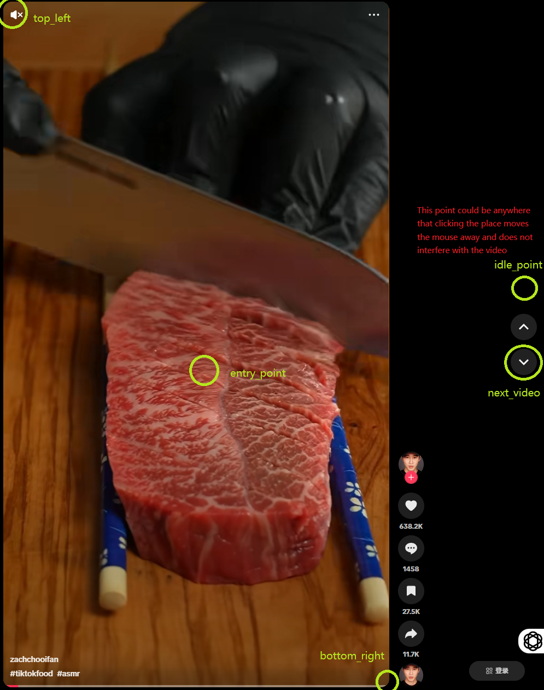

# Setting Up

<!-- ::: lumache


HIHIHI wisdaoduhasoud -->

Getting Started
-------------------
- Clone the GitHub project to your local setup

```bash
git clone https://github.com/yizhouzhao/LLM4SocialMedia
```

- Set up a virtual Python environment named testyml
  
```bash
conda env create -f environment.yml
```

- Make sure you are connected to the internet and have the default browser logged into TikTok/YouTube/Instagram accounts.

- Make sure your browser is not in full-screen mode.

  
Set your own configurations
-------------------

Based on different resolution, you need to set your own coordinate of screenshot being taken.
- navigate into main.py

```bash
manual_coordinate_adjustment(TikTok())
```
This function prints out the current x and y coordinate of your mouse, move your mouse around and put them in the poisiytion of the top left coordinate and right bottom, entry point, record them down.


Input the xy coordinate into Codes/config.py, and put in your own coordinates
```bash
TIKTOK_CONFIG = {

    "top_left": [Your_own_coordinate_here,Your_own_coordinate_here],
    "bottom_right": [Your_own_coordinate_here,Your_own_coordinate_here],
    "entry_point": [Your_own_coordinate_here,Your_own_coordinate_here],
    "idle_point": [Your_own_coordinate_here,Your_own_coordinate_here],
     "next_video": [Your_own_coordinate_here,Your_own_coordinate_here],

}
```


Do this for all the platforms: Youtube, TikTok, Instagram that you want to investigate.

Get your own APIs
---------------

in the file code/.env, type in the APIs

```bash
OPENAI_KEY = Your_own_API_key_here
GOOGLE_API_KEY = Your_own_API_key_here
REPLICATE_API_TOKEN = Your_own_API_key_here
DASHSCOPE_API_KEY = Your_own_API_key_here
```

## 🛠️ How to Obtain Each API Key

- **OpenAI API Key**:  
  Sign in to your [OpenAI account](https://platform.openai.com/account/api-keys), navigate to the API Keys section, and click **"Create new secret key"**.

- **Google API Key**:  
  Visit the [Google Cloud Console](https://console.cloud.google.com/), create a new project or select an existing one, enable the necessary APIs, and generate an API key under the **"Credentials"** section.

- **Replicate API Token**:  
  Log in to your [Replicate account](https://replicate.com/account/api-tokens), go to the API Tokens section, and click **"Create token"** to generate a new API token.

- **DashScope API Key**:  
  Access the [DashScope dashboard](https://dashscope.console.aliyun.com/), navigate to the API Key section, and create a new API key.


