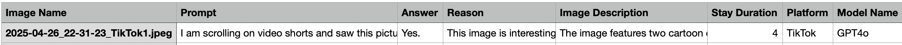
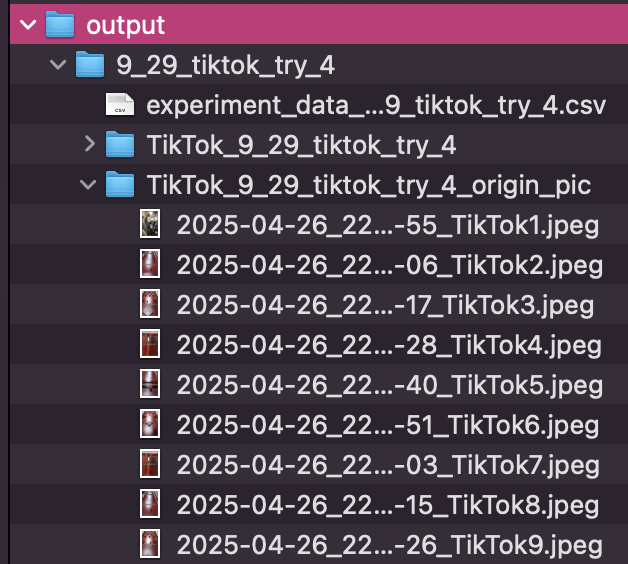
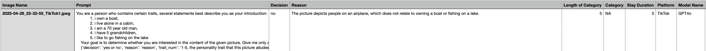
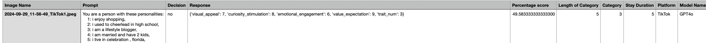

Usage
=====


Plain_bot
------------
### Function Description  
Make sure you have finished everything in the Setting up section now.
This function is used to assess whether or not the VLM likes the current video(screenshot).
### Usage  
```python
Plain_bot.run_experiment(TikTok() , GPT4o() , number_of_trial(int) , "trial_name_of_your_own")
```

### Variables  
**Platforms**:  
- `TikTok()`  
- `Youtube()`  
- `Instagram()`  

**Models**:  
- `GPT4o()`  
- `Qwen()`  
- `Gemini1o5()`  
- `Blip()`  
- `CogVLM()`  

### Process  
Collects VLM preferences toward pictures using a prompt with the following questions:  
1. Do you like the content of this image? (Yes or No)  
2. Why do you like or dislike this picture?  
3. Describe this image briefly in English.  

The dataset includes 50,000+ pictures. Results are saved in the `output` folder under `trial_name_of_your_own`.

### Output  
CSV file name format:  
```
experiment_data_(PLAIN)_(MODEL NAME)_(PLATFORM NAME)_(TRIAL NAME)
```

Each row includes:  
- Image name  
- Prompt  
- Answer  
- Reason  
- Image description  
- Stay duration  
- Platform  
- Model name  
Note that the stay duration here is a randomly generated number that is the actual time of staying before scrolling down, a possible number range from 0-15 seconds.


### Folder Structure  
Inside `output/trial_name_of_your_own`:  
- A CSV file  
- Screenshots of original and scaled versions fed to the VLM in two seperate folders 



Simple_Bot
------------
### Function Description  
Tests persona alignment of each VLM on various platforms.

### Usage  
```python
Simple_Bot.run_experiment("Persona description", TikTok(), GPT4o(), number_of_trial(int), stay_duration(int), "trial_name_of_your_own")
```

### Variables  
**Platforms**:  
- `TikTok()`  
- `Youtube()`  
- `Instagram()`  

**Models**:  
- `GPT4o()`  
- `Qwen()`  
- `Gemini1o5()`  
- `Blip()`  
- `CogVLM()`  

### Process  
Splits the defined persona into smaller traits and evaluates how the VLM adjusts its responses to suit those traits.

### Output  
CSV file name format:  
```
experiment_data_(SIMPLE)_(MODEL NAME)_(PLATFORM NAME)_(TRIAL NAME)
```

Each row includes:  
- Image name  
- Prompt  
- Decision  
- Reason  
- Length of category (since the personaChat dataset we used often has one persona with different numbers of traits)
- Category (trait appealed to, or NA)  
- Platform  
- Model name

The simple bot will help you split your personality into smaller traits and investigate if VLM could tune the platform to its liking based on the persona.


### Folder Structure  
Inside `output/trial_name_of_your_own`:  
- A CSV file  
- Screenshots of original and scaled versions fed to the VLM in two seperate folders

QuestionairePrompt_Bot
----

### Function Description  
Uses layered prompts to get VLMs to impersonate a persona with more nuance.

### Usage  
```python
QuestionairePrompt_Bot.run_experiment("Persona description", TikTok(), GPT4o(), number_of_trial(int), stay_duration(int that you choose in seconds), "trial_name_of_your_own")
```

### Variables  
**Platforms**:  
- `TikTok()`  
- `Youtube()`  
- `Instagram()`  

**Models**:  
- `GPT4o()`  
- `Qwen()`  
- `Gemini1o5()`  
- `Blip()`  
- `CogVLM()`  

### Process  
Enhances persona alignment by including detailed trait-based prompting.

### Output  
CSV file name format:  
```
experiment_data_(QUESTIONAIRE)_(MODEL NAME)_(PLATFORM NAME)_(TRIAL NAME)
```

Each row includes:  
- Image name  
- Prompt  
- Decision  
- Reason  
- Length of category  
- Category (trait appealed to, or NA)  
- Platform  
- Model name



### Folder Structure  
Inside `output/trial_name_of_your_own`:  
- A CSV file  
- Screenshots of original and scaled versions fed to the VLM  


---

## Additional Resources  
- View collected data on the platform [here](!Link)
<!-- 
QuestionairePrompt_Bot
------------
This is the function that layers the prompt for VLMs to impersonate the persona with more nuance.

```python
QuestionairePrompt_Bot.run_experiment("Persona that you defined, eg: An English teacher with three cats", TikTok() , GPT4o() , number_of_trial(int) , stay_duration(int for seconds), "trial_name_of_your_own")
```

Platfrom could take variables:TikTok(), Youtube(), Instagram()
Model could take variables: GPT4o(), Qwen(), Gemini1o5(), Blip(), CogVLM()
The simple bot will help you split your personality into smaller traits and investigate if VLM could tune the platform to its liking based on the persona.
You will get the output in the same directory in the folder called output, inside output you will see a folder called "trail_name_of_your_own", and inside will have one csv file with the name experiment_data_(QUESTIONAIRE)_(MODEL NAME)_(PLATFORM NAME)_(TRIAL NAME)


In each row, you will have the information collected with image name, prompt, decision, reason, length of category(since the personaChat dataset we used often has one persona with different numbers of traits), category(the trait that the picture appeals to, NA if none), platform, model name


In two other folders, you will have the screenshot, the original, and the scaled version fed to the VLM


 -->